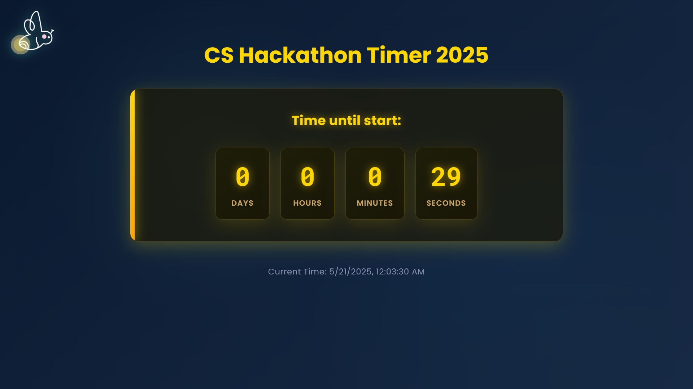
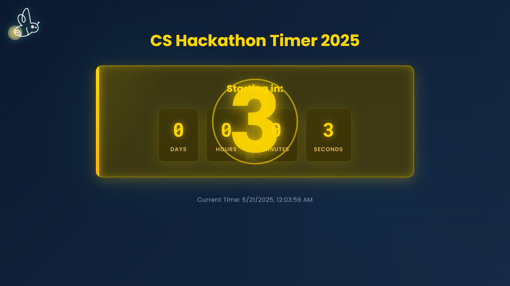
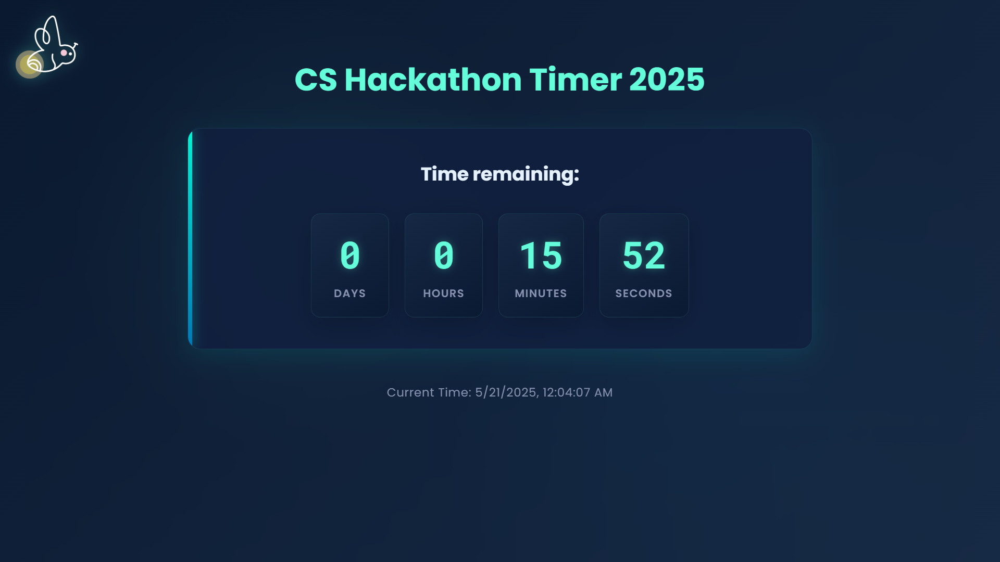
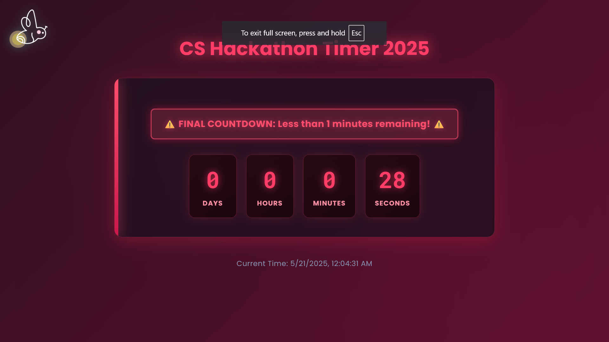
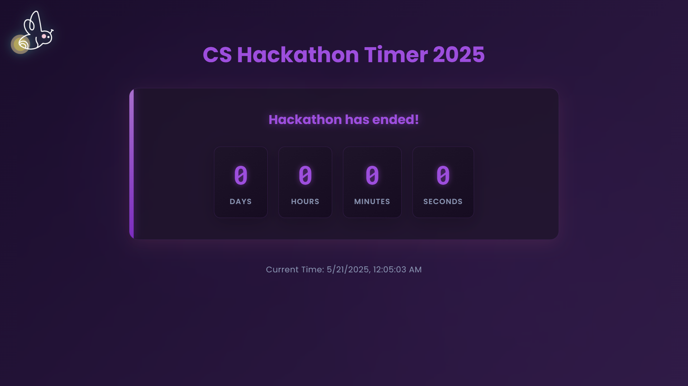

## Timer States

### 1. Idle State (Before the Event Starts)



### 2. Countdown to Start



### 3. Running State (During the Event)



### 4. Survival Mode (Final Minutes)



### 5. Completed State (Event Ended)



## Configuration

The application can be configured using environment variables. Create a `.env` file in the root directory with the variables you want:

| Variable                     | Description                                             | Default                 |
| ---------------------------- | ------------------------------------------------------- | ----------------------- |
| VITE_START_TIME              | Start time of the hackathon in ISO format               | 2025-05-19T18:50        |
| VITE_END_TIME                | End time of the hackathon in ISO format                 | 2025-05-19T19:55        |
| VITE_TIME_ZONE               | Timezone for the event                                  | Asia/Bangkok            |
| VITE_SURVIVAL_PERIOD_MINUTES | Minutes before end when "survival mode" warning appears | 1                       |
| VITE_EVENT_NAME              | Name of the event                                       | CS Hackathon Timer 2025 |

An example `.env` file is provided as `.env.example` for reference.

## Development

To run the project locally:

```bash
npm install
npm run dev
```
